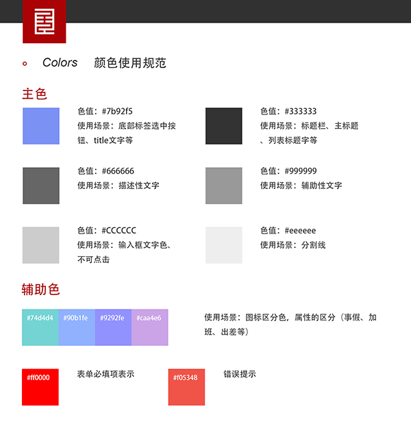

!> 随着移动端模块的不断增长，同一平台内各个模块间的风格和组件统一就显得尤为重要，这样不仅能提高界面的开发效率，也能统一设计师的设计风格，减少不必要的沟通和优化成本，结合UI规范在界面开发方面做了如下规范（特殊情况除外）

### 颜色

`一共提供了12种色调，主色6种，辅助色4种，错误色2种，所有模块的色调不能脱离这12种颜色，特殊情况除外（参考ui）`



为了统一方面使用，在项目中分别定义了全局的变量供使用（参考variables.less, 不要在项目中直接使用色值）

```js
@main-color: #7b92f5; //主色
@title-color: #333;  //标题颜色
@des-color: #666;  //描述性颜色
@second-color:#999; //辅助性，次要颜色
@dark-color:#ccc; //暗淡色
@bor-color: #eee; //边框，线条颜色
@tip-color: #ff0000; //提示颜色
@err-color: #f05248; //错误颜色

@other1-color: #74d4d4; //辅助色
@other2-color: #90bef1; //辅助色
@other3-color: #9292f2; //辅助色
@other4-color: #caa4e6; //辅助色

@radius: 8px; //圆角大小

```

### 间距

`元素之间正常间距为20px，实际间距参考ui`

```js
@box-mar: 20px; //元素与界面左右间距 普通块之间的间距
@box-padd: 20px 30px; //元素内间距
```


### 字体大小

```js
@font-large: 36px; //重要的标题字体大小
@font-middle: 32px; //次要的标题字体大小
@font-title: 30px; //普通的标题字体大小
@font-des: 28px; //描述性字体大小
@font-second: 24px; //辅助性文字大小
@font-tip: 20px; //提示性文字大小
```